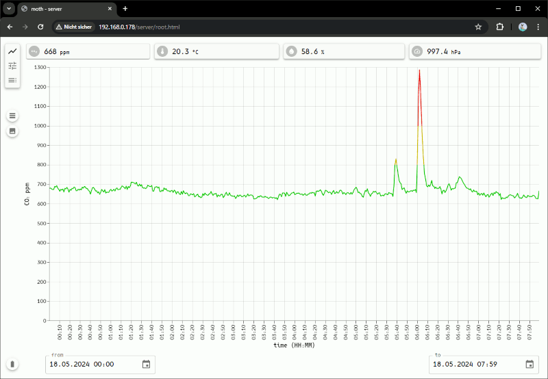

## MOTH CLient

---

A small webapp helping to understand and use the device api.

---

The api lets you do the following

|url|method|type|description|parameters|
|---|---|---|------------|--------------|
|/api/latest|GET|json|get the latest measurement as JSON|none|
|/api/valcsv|GET|csv|get the last hour of measurements as CSV|none|
|/api/datcsv|GET|csv|get the contents of a data file as CSV|"file" i.e. 2024/05/20230526.dat|
|/api/valcsv|GET|binary|get the last hour of measurements as binary data|none|
|/api/datout|GET|binary|get the contents of a file as binary data|"file" i.e. 2024/05/20230526.dat|
|/api/dirout|GET|json|list the contents of a folder|"folder" i.e. "2024", "2024/05/", "config"|
|/api/upload|POST|json|upload files to the device|"file" i.e. "server/root.html" "content" multipart file content|
|/api/datdel|GET|json|delete files from the device|"file" i.e. 2024/05/20240526.dat|
|/api/dirdel|GET|json|delete folders from the device|"folder" i.e. "2024", "2024/05/"|
|/api/dspset|GET|json|change device display|"p" 0: display mode -> v:[0:2] 1: display theme -> v:[0:1] 2: table value-> v:[0:2] 3: chart value-> v:[0:5]|
|/api/status|GET|json|get details about device status|none|
|/api/netout|GET|json|get a list of networks visible to the device|none|
|/api/netoff|GET|json|disconnect the device|none|
|/api/co2cal|GET|json|calibrate the CO₂ sensor to a given reference value|"ref" i.e. 420|
|/api/co2rst|GET|json|reset the CO₂ sensor to factory||
|/api/esprst|GET|json|reset the device||
|/api/update|POST|json|update device firmware|"content" multipart file containing the new binary|

