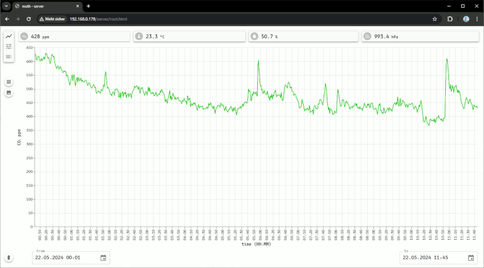
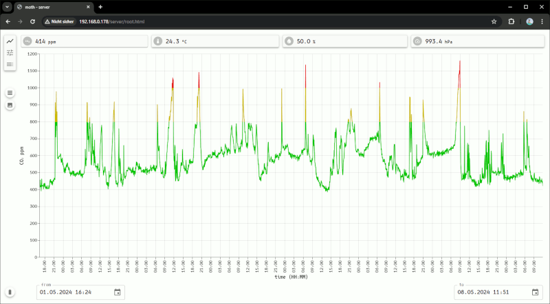
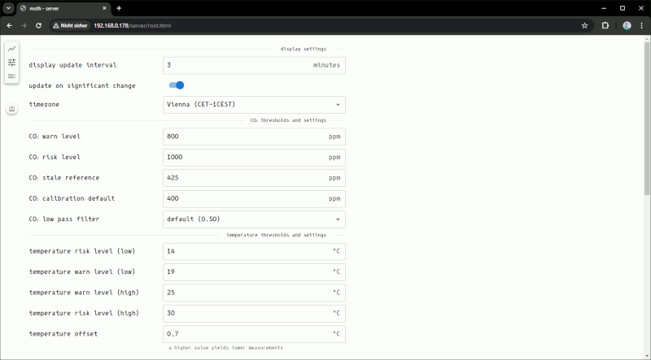
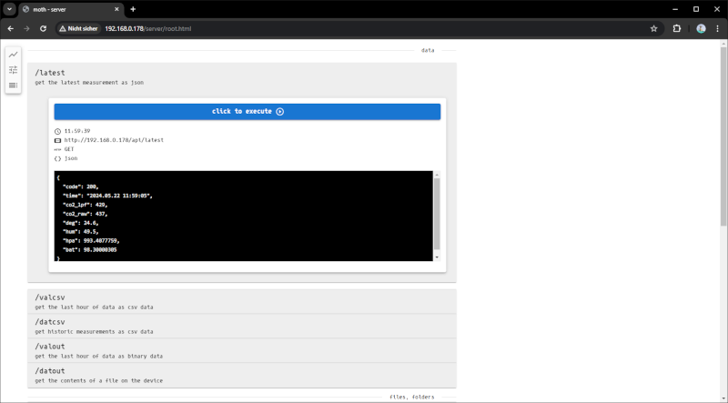

## CLient

---

The client subproject is react-web-application, storable on the device's SD-card, then consumable with any browser directly from the device.

The Client UI is split into 3 main pages:

---

- #### client-chart

It is possible to show recent and historic CO₂, temperature, humidity, pressure and battery data.

Date/Time Pickers can be used to specify the range of data to be shown in the chart.

The current range of data can also be exported to:

  - CSV
  - PNG

---

- #### client-config

This pages offers a convient way to configure the device through a reactive UI.

- #### client-api

This is a helper page to descibe the device's api. You can either use this page as-is, or if you are into scripting, it will help to understand the device api.

---

#### server-rest-api

A short list of the device's api:

|url|method|type|description|parameters|
|---|---|---|------------|--------------|
|/api/latest|GET|json|get the latest measurement as JSON|none|
|/api/valcsv|GET|csv|get the last hour of measurements as CSV|none|
|/api/datcsv|GET|csv|get the contents of a data file as CSV|"file" i.e. 2024/05/20230526.dat|
|/api/valcsv|GET|binary|get the last hour of measurements as binary data|none|
|/api/datout|GET|binary|get the contents of a file as binary data|"file" i.e. 2024/05/20230526.dat|
|/api/dirout|GET|json|list the contents of a folder|"folder" i.e. "2024", "2024/05/", "config"|
|/api/upload|POST|json|upload files to the device|"file" i.e. "server/root.html" "content" multipart file content|
|/api/datdel|GET|json|delete files from the device|"file" i.e. 2024/05/20240526.dat|
|/api/dirdel|GET|json|delete folders from the device|"folder" i.e. "2024", "2024/05/"|
|/api/dspset|GET|json|change device display|"p" 0: display mode -> v:[0:2] 1: display theme -> v:[0:1] 2: table value-> v:[0:2] 3: chart value-> v:[0:5]|
|/api/status|GET|json|get details about device status|none|
|/api/netout|GET|json|get a list of networks visible to the device|none|
|/api/netoff|GET|json|disconnect the device|none|
|/api/co2cal|GET|json|calibrate the CO₂ sensor to a given reference value|"ref" i.e. 420|
|/api/co2rst|GET|json|reset the CO₂ sensor to factory||
|/api/esprst|GET|json|reset the device||
|/api/update|POST|json|update device firmware|"content" multipart file containing the new binary|

---

There are multiple ways the device can connect to the internet:

- When no wifi-connection has been configured yet, the device will start in AP-mode, providing it's own network. You can connect you mobile phone or computer to that network and configure i.e. your home wifi.
- When wifi-connections have been configured, the device will connect to the network with the highest signal strength.

What has been working for me is configuring my home network and my mobile's wifi-hotspot. That way the sensor will connect to the home network most of the time, but there is a fallback to the hotspot of my phone when i'm away. When in a hotel i add the hotel network, so i can save data on the hotspot.
