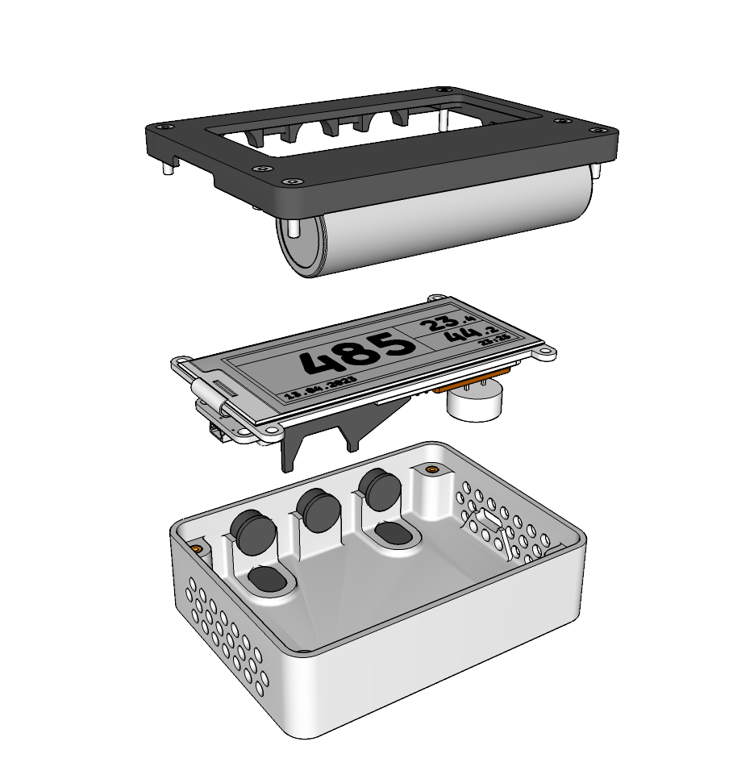

# <a name="moth_parts">MOTH Parts and Assembly</a>

Building the sensor is split into two main parts. Electric assembly and housing.

---

List of parts that need to be bought:

- ## [ELECTRIC parts](electricparts.md)

---

Assembly instructions for the electric parts:

- ## [ELECTRIC assembly](electricassembly.md)

---

List of printable parts and some postprocessing hints:

- ## [PRINTED parts](printedparts.md)

---

Final assembly of the Device:

- ## [ASSEMBLY](assembly.md) :: MISSING

---