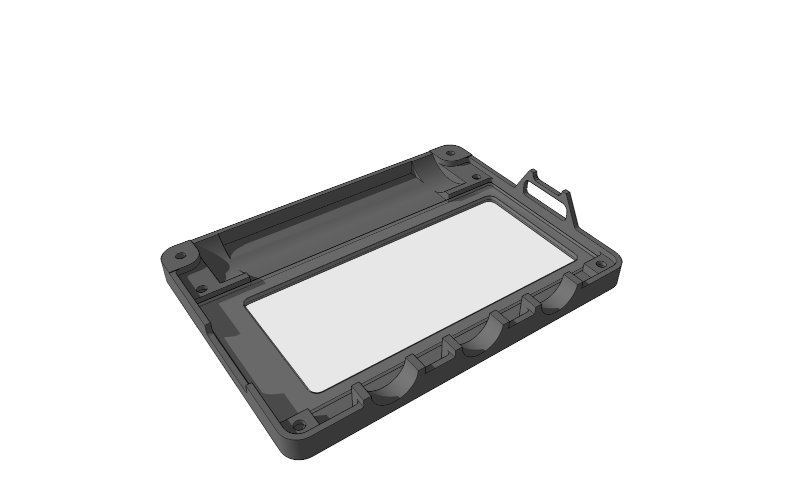
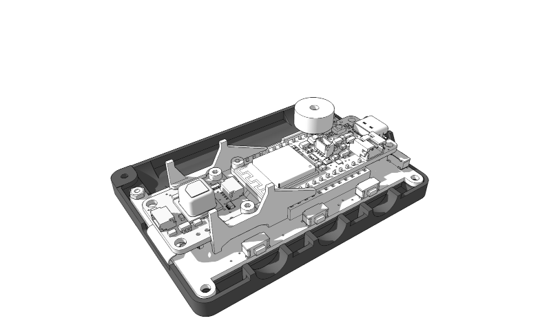
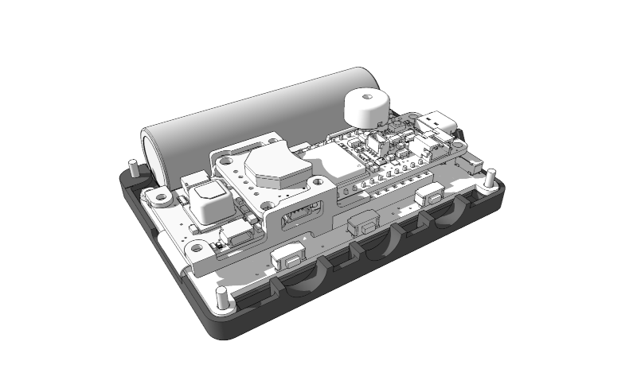
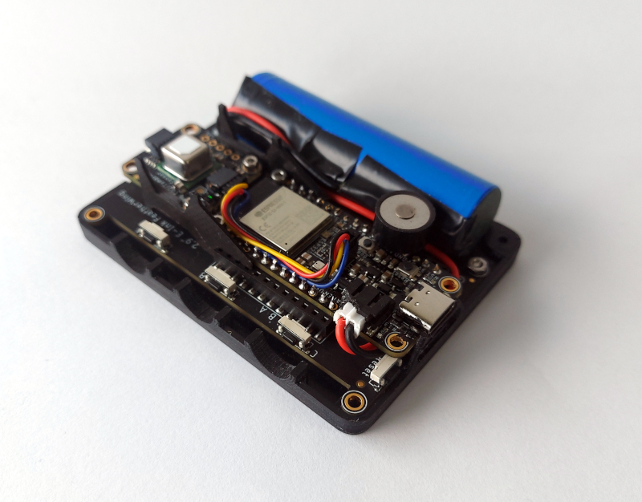
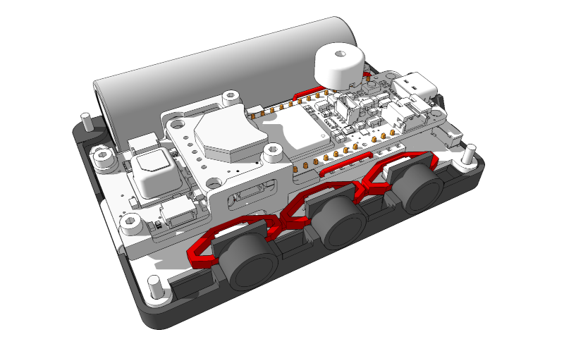
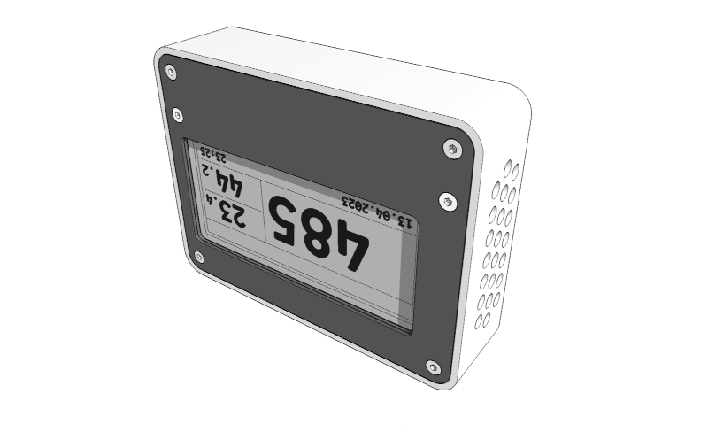

# Device Assembly

After having built the [Electric Assembly](electricassembly.md) and having printed and finished all [Printed parts](printedparts.md) all parts can be assembled to the full device.

---

User your soldering iron to press the threaded inserts into the lower housing, then insert the mountplugs into the lower housing if needed.

---

Cut a rectangle of acrylic glass to fit the upper housing.

---

Place the [Electric Assembly](electricassembly.md) on top of the acrylic glass onto the upper housing and use 2 M2 x 5 screws and 2 M2 nuts to attach.

---

Add the battery and find a place to lead the cable to the batter plug on the microcontroller. Double- and triplecheck polarity of the battery before plugging it into the microcontroller. I added 2 little drops of glue under the battery to ease handling afterwards.
I had to file a little edge off the buzzer to make battery and buzzer fit nicely.

---

Place the buttons into the lower housing, if you keep the housing positioned like in the picture, everything will stay in place during the next step.

---

Now you can slide the upper housing with the electric assembly attached to it into the lower housing and add 4 M2 x 8mm screws for final attachment.

---

Fully assembled.

