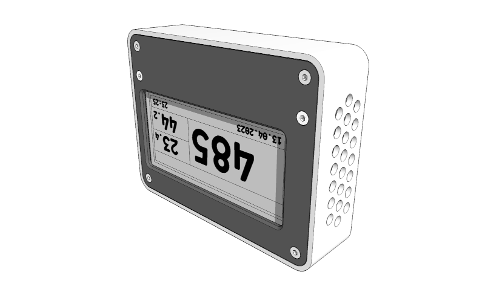

# Device Assembly

After having built the [Electric Assembly](electricassembly.md) and having printed and finished all [Printed parts](printedparts.md) all parts can be assembled to the full device.

---

User your soldering iron to press the threaded inserts into the lower housing, then insert the mountplugs into the lower housing if needed.

---

Cut a rectangle of acrylic glass to fit the upper housing.

---

Place the [Electric Assembly](electricassembly.md) on top of the acrylic glass onto the upper housing and use 2 M2 x 5 screws and 2 M2 nuts to attach.

---

Add the battery and find a place to lead the cable to the battery plug on the microcontroller. Double- and triplecheck polarity of the battery before plugging it into the microcontroller. I added 2 little drops of glue under the battery to ease handling afterwards.
I had to file a little edge off the buzzer to make battery and buzzer fit nicely.

---

Seat the assembled buttons into the assembly and be sure each button can operate freely.

---

Place the lower housing upright so it can accept the rest of the assembly.

---

Insert the assembly, buttons first, be sure all cables go in smoothly and dont block one the threads that connect lower and upper housing.
Once inserted add 4 M2 x 8mm screws for final attachment.

---

Fully assembled.

