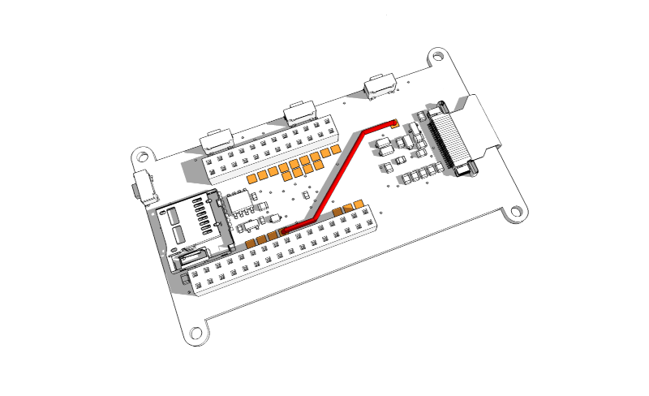
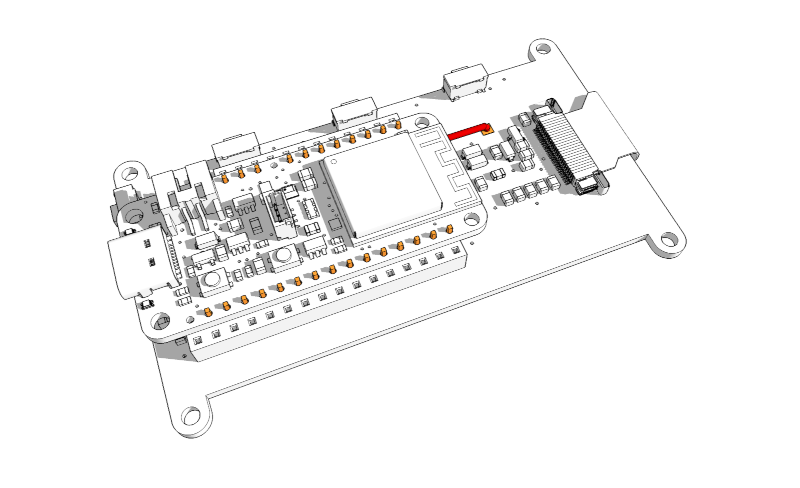
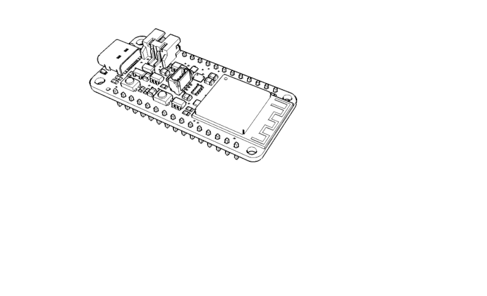
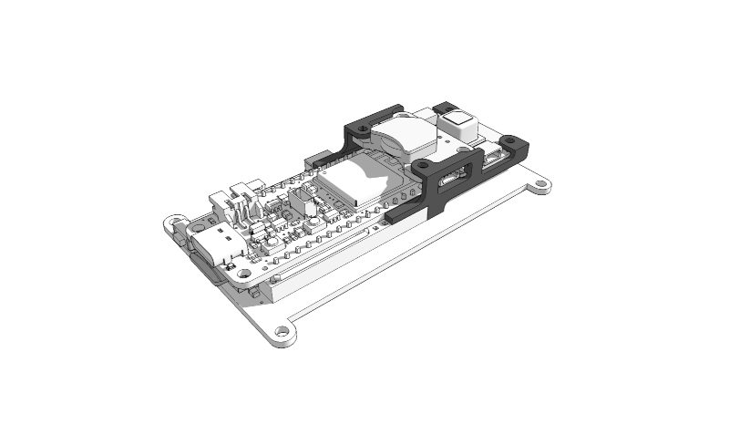
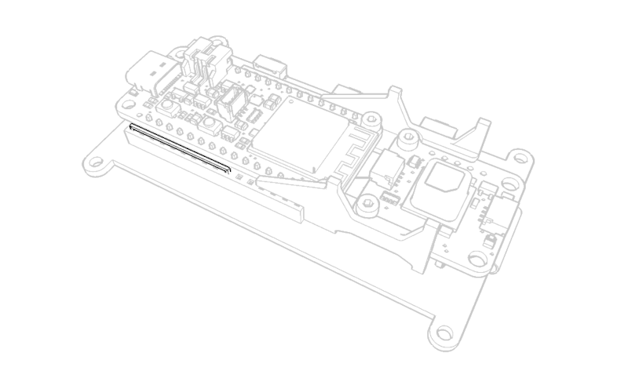
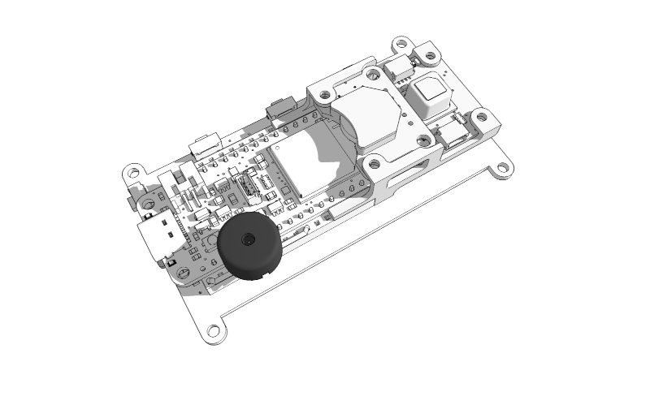

# Electric Assembly

Lay the display flat on a soft surface (i.e. a piece of soft cloth). On the backside of the display solder a connection from the pad corresponding to the A4 pin to the pad labelled with "busy".

---

Place the microcontroller directly over the the display. Stick short pins (should portrude ~1mm out when fully inserted) through each microcontroller pinhole into the respective display pinholes. Do NOT use a pin header strip, the microcontroller must sit directly on the display. Do NOT add a pin to the RST pinhole. This pin will be bridged to from another pin for more control.

---

Solder all pins (not RST) to the microcontroller. After soldering you can separate microcontroller and display. You should now have the microcontroller with short pins soldered to it.

---

3d-print [STL "supports2"](supports2.stl), clean printed parts with a file or sandpaper, cleanup holes with a 2mm drill if required. Use 6 M2 x 5mm screws and 6 M2 nuts to connect the feather esp32-s2 microcontroller and the scd-41 sensor. Try not to touch the CO₂ sensors central part to avoid contamination. Connect microcontroller, RTC and scd-41 sensor with the Stemma QT cables (not pictured).

---

Carefully reattach to display to get a unit of display, microcontroller, RTC and CO₂ sensor.

---

Connect the pinhole corresponding to the microcontrollers A5 pin to the display RST pinhole. Normally the display would have been hardwirded to be microcontrollers reset button, but we need to be able to reset the display at runtime and this gives the possiblity to do so.

---

Attach the Buzzer so its pins go into GND and A1.

---

The Electric Assembly is now ready to be configured and to have a sketch uploaded. Please refer to [MOTH Core](../moth_core/README.md) for further instructions.

---