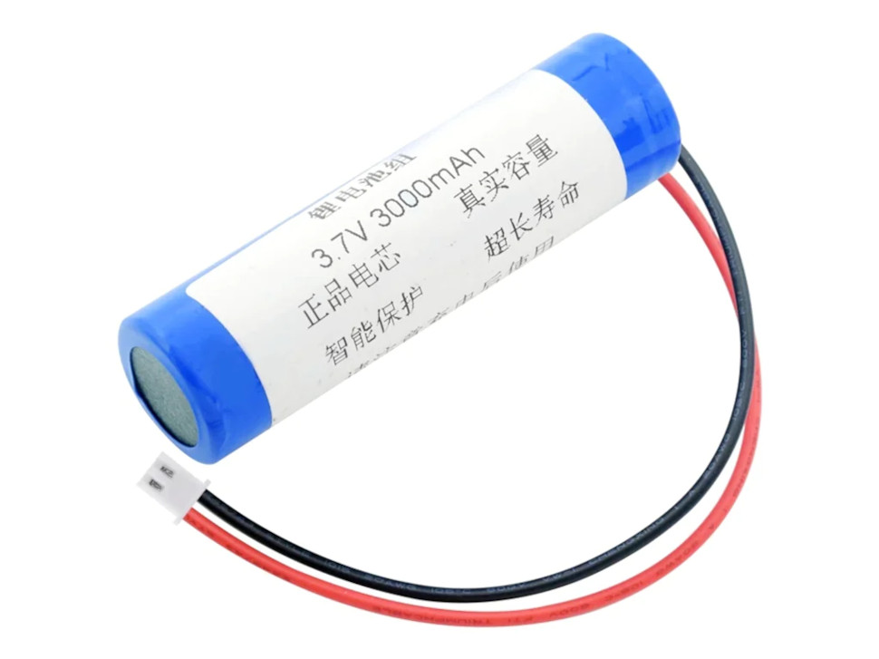
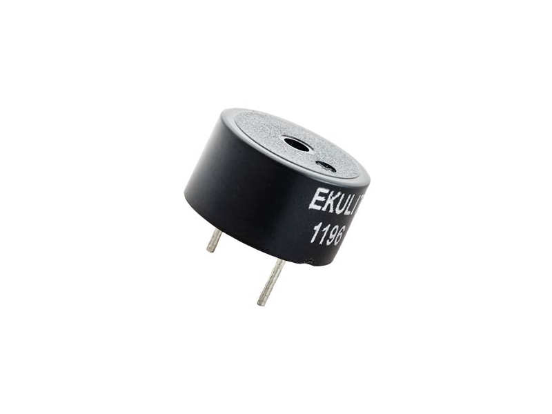
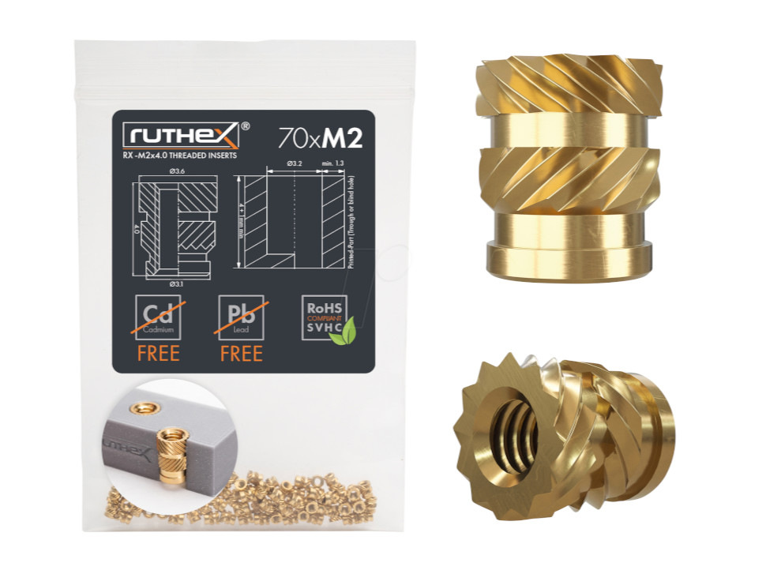
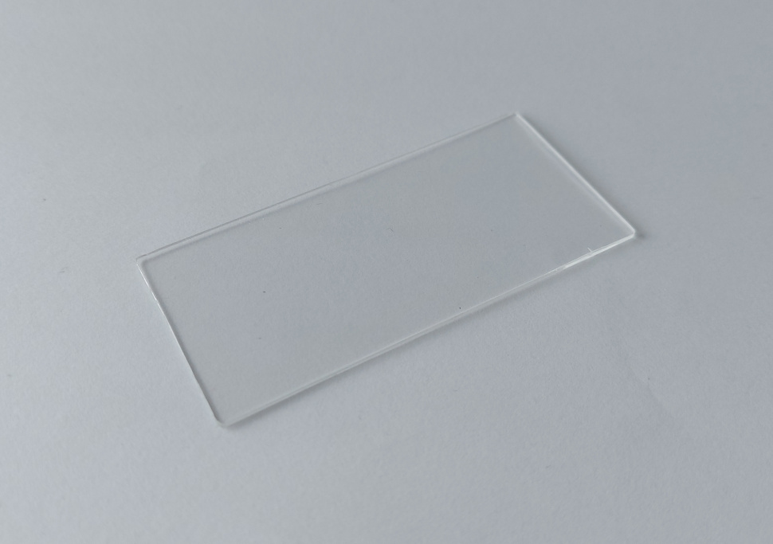

# Electric parts

- <a href="#microcontroller">Adafruit ESP32-S2 Feather with BME280</a>
- <a href="#co2sensor">Adafruit SCD-41 - True CO2 Temperature and Humidity Sensor - STEMMA QT / Qwiic</a>

<a href="https://www.adafruit.com/product/5303" name="microcontroller">Adafruit ESP32-S2 Feather with BME280</a> The microcontroller. Not an S3, but it has an BME-280 Sensor onboard, thus saving an extra oart to be fit into the housing. The processors power is far beyond necessary and the pressure sensor delivers extra precision to the CO₂ sensor.

---

<a href="https://www.adafruit.com/product/5190" name="co2sensor">Adafruit SCD-41 - True CO2 Temperature and Humidity Sensor - STEMMA QT / Qwiic</a> The actual CO₂ sensor. Easy to connect due STEMMA QT connection with the microcontroller.

---

[STEMMA QT / Qwiic JST SH 4-Pin Cable - 50mm Long](https://www.adafruit.com/product/4399) Cable connecting microcontroller and CO₂ sensor.

---

[Adafruit 2.9" Grayscale eInk / ePaper Display FeatherWing - 4 Level Grayscale](https://www.adafruit.com/product/4777) Cable connecting microcontroller and CO₂ sensor.

---

[3,7 V 3000mAh 18650 Lithium Li-Ion Battery Pack](https://batteryzone.de/products/3-7-v-3000mah-18650-lithium-li-ion-batterien-pack-wiederaufladbare-mit-xh-2-54mm-2pin-stecker-fur-rc-boot-diy-power-bank?variant=40528117825744&currency=EUR&utm_medium=product_sync&utm_source=google&utm_content=sag_organic&utm_campaign=sag_organic&gclid=CjwKCAiA-8SdBhBGEiwAWdgtcNf_XDsI0CIc7C1LFinTcrsDmiB5t58YchcTnI23JrJWoPHF5A4VPxoC0mYQAvD_BwE) 18650 Battery Pack with PH2.0 plug.

---

[Buzzer](https://www.reichelt.at/at/de/piezosummer-summer-cpm-121-p35924.html?&trstct=pol_4&nbc=1)

---

Hardware:

- 6 screws M2 x 5mm
- 4 screws M2 x 8mm
- 6 nuts M2
- 4 [threaded inserts M2 x 4mm](https://www.reichelt.at/at/de/3d-druck-gewindeeinsaetze-m2x4-70-stueck-rx-m2x4-p332211.html?PROVID=2807&gclid=Cj0KCQjwu-KiBhCsARIsAPztUF0J6DnrXp0YX_Ajaskqt8CrePC7NPw2n9GdOXkIdW2tjeDlc9kSpYEaAjDGEALw_wcB)

---

acrylic glas 1mm, ~ 78mm x ~36mm

---
