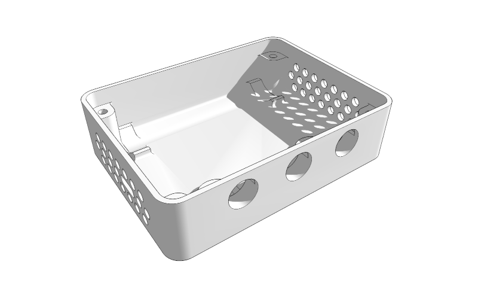
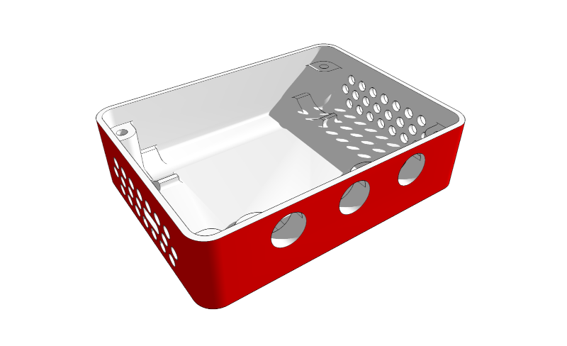
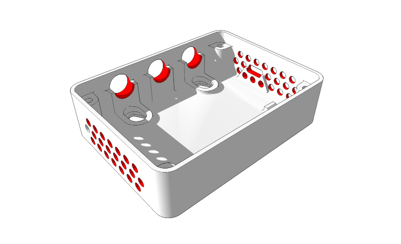
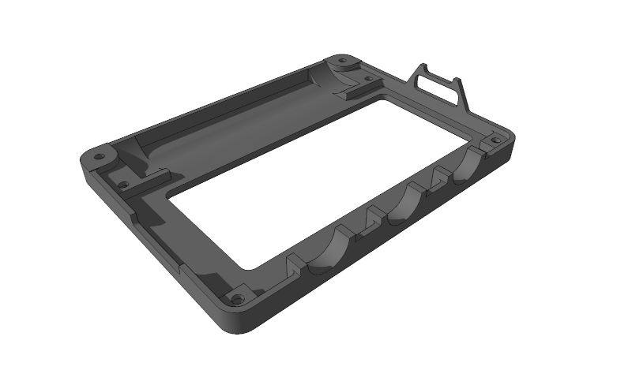
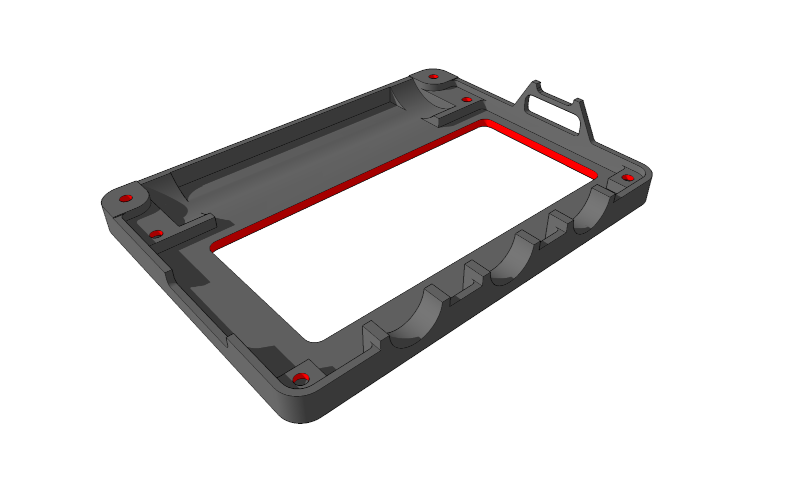
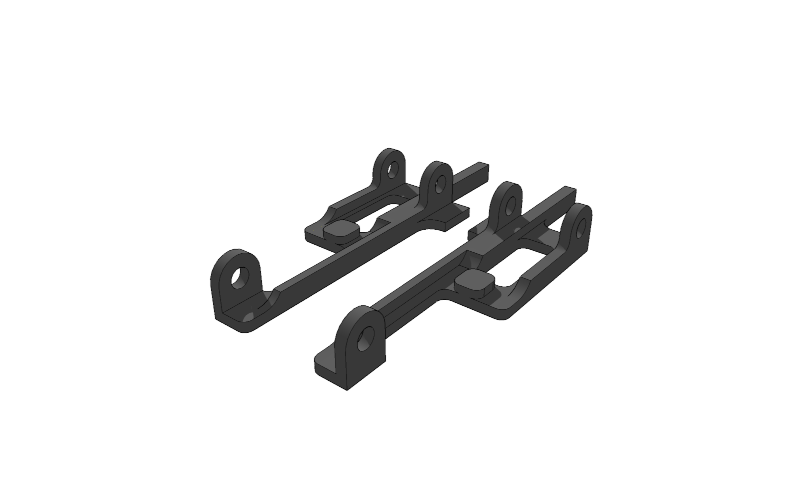
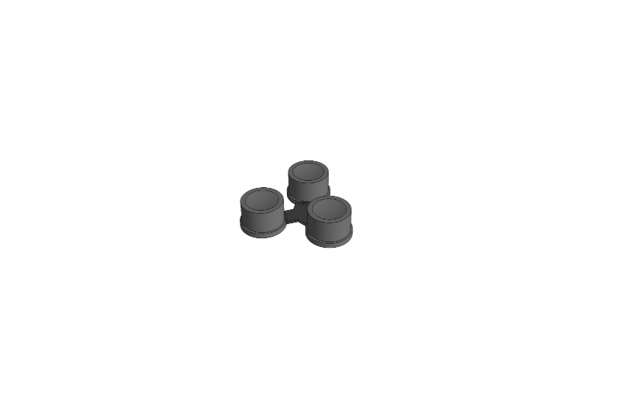
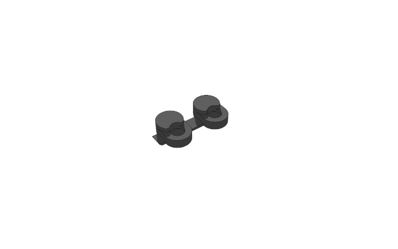

# PRINTED parts

### [Lower Housing](housing_lower.stl)

This is the part taking the longest to print and also the one requiring most finishing.

You can leave this part as it is and it should still work, but the device will look much better if you sand the layered surfaces to a smooth finish. I used 180 grain sandpaper on the surfaces marked red, then worked my way up to 320 grain, then 400 and 600.

Next, i cleaned up the button openings for smooth button operation. Last step was opening all venting holes with a 4mm drill, this gives crisp edged on the surface and removes any artifact from printing overhang.

---

### [Upper Housing](housing_upper.stl)

The upper housing takes less time to print and does not require any substantial finishing.

Again, you should be able to use the part as it is, but it will look better when you file/sand the display opening. You have to open the screwholes with a 2mm drill.

#### [Upper Housing with raft](housing_upper_b.stl)

For unknown reasons, i had problems with warping on the upper housing part. To fix these issues, there is another version with thick rafts around the part borders.
---

### [Supports](supports2.stl)

The supports serve to connect microcontroller, RTC and the CO₂ sensor and also act as flexible support for the CO₂ sensor to reduce mechanical load should the device be dropped.

---

### [Buttons](buttons.stl)

The buttons can later be used to toggle wifi, display and acoustic feedback.

---

### [Mountplugs](mountplugs.stl)

These little parts go into the wall mount openings of the lower housing. When inserted as printed, the device can not be wall mounted. When drilling through the plugs with a 4mm drill, but leavong the plug in the lower housing, the device can be mounted fixed which provides some degree of theft protection. When omitted altogether the device can be taken on or off the wall.

---